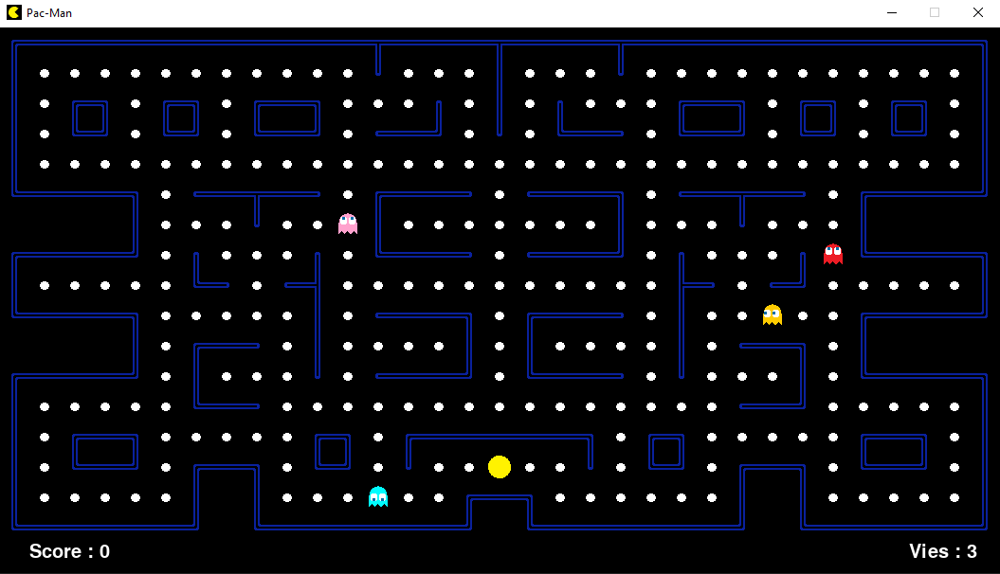

# 🟡 PacMan

Le PacMan est le premier petit jeu que j'ai développé en python. Il n'est pas tout à fait complet par rapport au jeu original, mais il reprend les mécaniques de base.

Le programme fonctionne avec la bibliothèque pygame et nécessite d'être dans le même répertoire que le dossier data pour être executé (en cas d'erreur avec le chemin des .png, le dossier data doit être mis dans le répertoire utilisateur).
